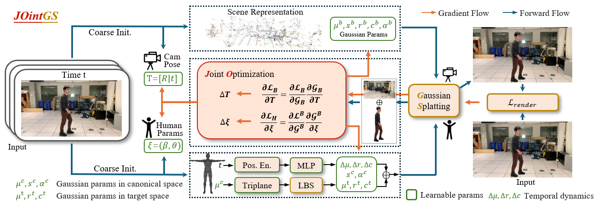

# JOintGS: Joint Optimization of Cameras, Bodies and 3D Gaussians for In-the-Wild Monocular Reconstruction

This repository is a reference implementation for JOintGS, a unified framework that jointly optimizes camera extrinsics, human poses, and 3D Gaussian representations to achieve robust, high-fidelity, and animatable 3D human avatar reconstruction from unconstrained monocular videos with coarse initialization.


[[Paper](https://arxiv.org/abs/???)]


> [**JOintGS**](https://arxiv.org/abs/???),            
> [Zihan Lou](???), 
> [Jinlong Fan](???), 
> [Jing Zhang](???),   


<p float="center">
  
</p>

# Getting Started

We tested our system with Ubuntu ??? using a CUDA 12.8 compatible GPU.

- Clone our repo:
```
git clone ???
```

- Run the setup script to create a conda environment and install the required packages.
```
source scripts/conda_setup.sh
```

# Preparing the datasets and models

## Datasets
- Download the SMPL neutral body model

- Download NeuMan dataset and pretrained models:


After following the above steps, you should obtain a folder structure similar to this:

```
data/
├── smpl
│   ├── SMPL_NEUTRAL.pkl
├── neuman
│   └── dataset
│       ├── bike
│       ├── citron
│       ├── jogging
│       ├── lab
│       ├── parkinglot
│       └── seattle
```


# Training

## 💾  Pre-trained Checkpoints
You can download our pre-trained model checkpoints directly from Hugging Face Hub, allowing you to bypass the training process.
All checkpoints are hosted at the following Hugging Face repository. **Please visit this URL to download the files:**
[**Hugging Face Repository: louzihan/JOintGS**](https://huggingface.co/louzihan/JOintGS)

After following the above steps, you should obtain a folder structure similar to this:
```
checkpoints/
├── neuman
│   ├── bike
│   ├── citron
│   ├── jogging
│   ├── lab
│   ├── parkinglot
│   └── seattle
```

# Evaluation

# Citation

